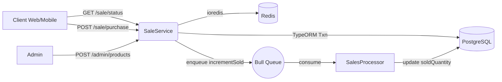

# Flash Sale Platform

A high-throughput flash sale backend using Redis for hot-path inventory and locks, and PostgreSQL for durable orders.

## System Diagram


## Setup
- Prereqs: Node.js 16+, Docker, Docker Compose
- Infra:
  ```bash
  docker-compose up -d
  ```
- Backend:
  ```bash
  cd backend
  npm install
  cp .env.example .env
  npm run start:dev
  ```

- Front end:
  ```bash
  cd frontend
  npm install
  npm run start
  ```
- API:
  - Base: http://localhost:3000
  - Docs: http://localhost:3000/api/docs

- Front End local: http://localhost:3001

- Client calls POST `/api/v1/sale/purchase`
- API acquires per-user-per-product Redis lock (SET NX PX)
- Reads Redis inventory, validates sale window and prior purchase
- Atomically `DECRBY` inventory
- Creates order in PostgreSQL within a transaction and commits
  - Asynchronously increments `soldQuantity`
  - Releases lock

## Tradeoffs
1. Performance vs Consistency

   Redis as the primary fast path for inventory

   Pros: Ultra-low latency (O(1) atomic ops), high throughput, low DB contention with per-user-per-product locks.

   Cons: Risk of temporary drift between Redis inventory and Postgres (e.g., crash after Redis DECR but before DB commit). We mitigate with transactions, background updates, and reconciliation options.

2. Latency vs Reliability

   Synchronous order write, asynchronous soldQuantity update

   Pros: Users get fast responses while the authoritative order is written in a DB transaction; non-critical soldQuantity is updated via Bull queue with retries/backoff.

   Cons: Requires queue workers, retries, idempotency, and monitoring to avoid lost/duplicated side effects.

3. Simplicity vs Scalability

   Redis + PostgreSQL + Queue + Locks (+ Cache-aside + Warm-up)

   Pros: Scales horizontally for high-traffic events; reduces hot-path DB load; cache-aside and warm-up improve resilience.

   Cons: Higher system complexity (locks, cache priming, queue processors) and more failure modes to observe.

4. Strong vs Eventual Consistency

   Strong: Orders (transactional in Postgres)

   Eventual: Inventory key in Redis and soldQuantity in Postgres

   Pros: Fast checkout path with acceptable eventual consistency for counters.

   Cons: Temporary mismatches are possible until background updates complete or reconciliation runs.

5. Cost vs Reliability

   Distributed cache and background processing

   Pros: Offloads expensive operations from Postgres, improving stability under load.

   Cons: Additional infra (Redis, queue, workers) and operational overhead (alerts, dashboards, DLQ handling).

- **Run k6**
  ```bash
  # Default BASE_URL is http://localhost:3000/api/v1.0
  k6 run load-test/flash-sale-k6.js
  # Optional: specify BASE_URL explicitly
  BASE_URL=http://localhost:3000/api/v1.0 k6 run load-test/flash-sale-k6.js
  ```

  The k6 script automatically discovers the latest product ID via `GET /sale/first`, so you do not need to manually set a productId.

  Edit `options.scenarios` in `load-test/flash-sale-k6.js` to change virtual users and durations.

- **Interpreting results**
  - `http_req_failed` threshold should stay low (< 5%). If high, the system is failing requests under load.
  - `http_req_duration p(95)` shows latency; keep within your SLO (e.g., < 800ms).
  - Purchase checks accept 200/201 (success) and 400/403 (expected business rejections). The controller logs errors and returns `{ success: false, error: "..." }` for graceful failures, avoiding 5xx.

## Database Integrity (Postgres constraints)

- **Orders** (`backend/src/sale/entities/order.entity.ts`)
  - `CHECK (quantity > 0)` and `CHECK (price >= 0)`
  - Partial unique index to prevent duplicates: unique on `(userId, productId)` where `status = 'completed'`
    - Guards against duplicate completed orders even under concurrency.

- **Products**
  - Recommendation (optional): `CHECK (soldQuantity >= 0 AND soldQuantity <= totalQuantity)`
  - We also maintain invariants in code and update `soldQuantity` via Bull queue with retries.

- **How it works with the flow**
  - App acquires a Redis lock per user/product, decrements Redis inventory, writes order in a DB transaction, then enqueues `incrementSold`.
  - If a duplicate completion slips through, the DB unique constraint fails and the transaction rolls back.

## Future Improvements
  1. Enhanced Locking Reliability

  Use Redlock
  or a multi-node Redis cluster for stronger fault tolerance in distributed environments.

  Add lock renewal and jitter-based backoff to avoid TTL expiration during long transactions.

  Implement per-product lock sharding to reduce contention on hot items.

  2. Queue & Worker Resilience

  Add Dead Letter Queue (DLQ) for failed jobs and retry policies with exponential backoff.

  Make workers idempotent using unique job IDs or transaction tokens.

  Track queue lag and throughput metrics (e.g., via Bull Board or custom Prometheus exporter).

  3. Cache Consistency & Recovery

  Enable AOF (Append-Only File) persistence for Redis or periodically sync Redis inventory from PostgreSQL.

  On service startup, run an inventory warm-up process to rebuild Redis cache from DB.

  Add a scheduled reconciliation job to verify that totalQuantity - soldQuantity == Redis.inventory.

  4. Database Scalability

  Introduce connection pooling (e.g., PgBouncer) and read replicas for analytics queries.

  Use partitioned tables or per-product order tables to reduce write contention under heavy load.

  Consider logical sharding by product category or sale event for extreme scale.

  5. Observability & Monitoring

  Expose key metrics:

  redis_latency_ms, queue_backlog, order_insert_latency_ms, and lock_wait_time_ms.

  Integrate Prometheus + Grafana dashboards.

  Configure alerting thresholds for high queue lag, Redis memory usage, or DB slow queries.

  6. Testing & Chaos Resilience

  Run chaos tests simulating Redis crashes or worker downtime to verify rollback and recovery flows.

  Implement canary releases and auto-retry on transient DB errors for smoother deployments.

  7. Security & Compliance

  Rate-limit /sale/purchase per user/IP to mitigate bots or abuse.

  Use Redis AUTH, TLS, and VPC isolation for secure access.

  Audit logs of Redis operations and order creation for traceability.