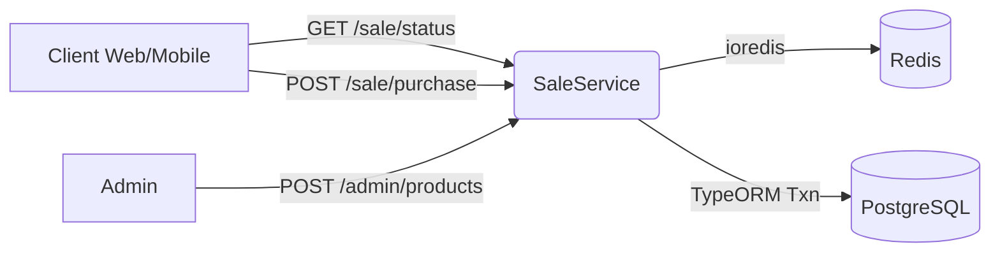

# Flash Sale Platform

A high-throughput flash sale backend using Redis for hot-path inventory and locks, and PostgreSQL for durable orders.

## System Diagram


## Setup
- Prereqs: Node.js 16+, Docker, Docker Compose
- Infra:
  ```bash
  docker-compose up -d
  ```
- Backend:
  ```bash
  cd backend
  npm install
  cp .env.example .env
  npm run start:dev
  ```
- API:
  - Base: http://localhost:3000
  - Docs: http://localhost:3000/api/docs

## System Flow
- Client calls POST `/api/v1/sale/purchase`
- API acquires per-user-per-product Redis lock (SET NX PX)
- Reads Redis inventory, validates sale window and prior purchase
- Atomically `DECRBY` inventory
- Creates order in PostgreSQL within a transaction and commits
- Asynchronously increments `soldQuantity`
- Releases lock

## Tradeoffs
- Redis as hot source for inventory
  - Pros: O(1) atomic ops, high throughput, low DB contention
  - Cons: Needs sync logic when product totals change
- Per-user lock
  - Pros: Prevents duplicate concurrent buys
  - Cons: TTL tuning and lock management complexity
- Eventual consistency on `soldQuantity`
  - Pros: Faster checkout path
  - Cons: Requires reconciliation on failures

- **Run k6**
  ```bash
  # Default BASE_URL is http://localhost:3000/api/v1.0
  k6 run load-test/flash-sale-k6.js

  # Optional: specify BASE_URL explicitly
  BASE_URL=http://localhost:3000/api/v1.0 k6 run load-test/flash-sale-k6.js
  ```

  The k6 script automatically discovers the latest product ID via `GET /sale/first`, so you do not need to manually set a productId.

- **Adjusting load**
  Edit `options.scenarios` in `load-test/flash-sale-k6.js` to change virtual users and durations.

- **Interpreting results**
  - `http_req_failed` threshold should stay low (< 5%). If high, the system is failing requests under load.
  - `http_req_duration p(95)` shows latency; keep within your SLO (e.g., < 800ms).
  - Purchase checks accept 200/201 (success) and 400/403 (expected business rejections). The controller logs errors and returns `{ success: false, error: "..." }` for graceful failures, avoiding 5xx.